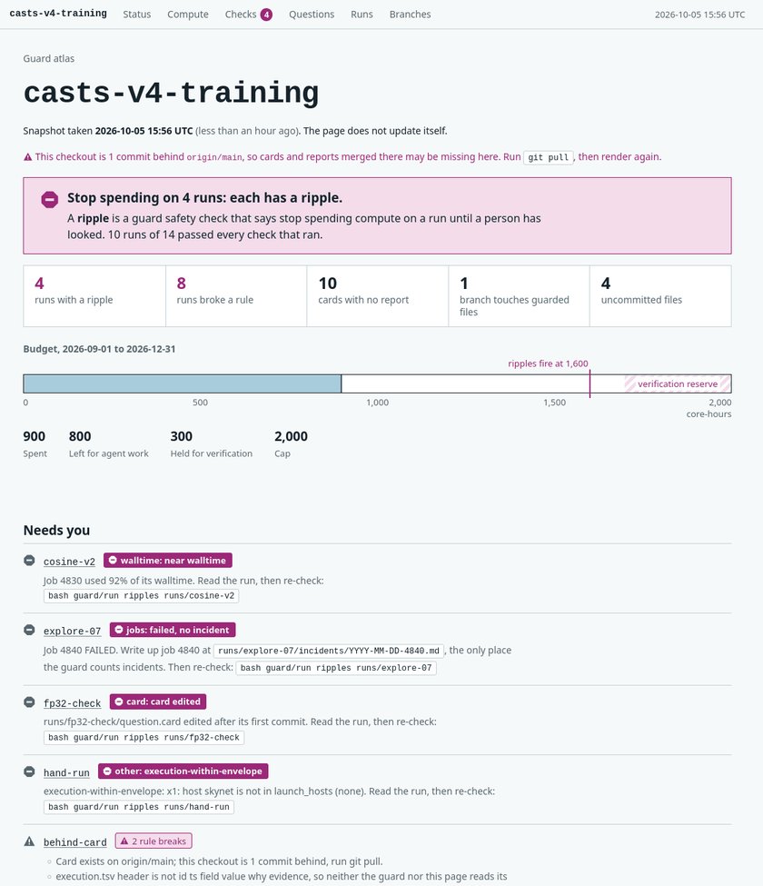

# Draw a project's atlas

`guard atlas` draws one read-only page of a guarded project. It opens with whether anything is wrong, how much budget is left, and what needs you, each with a command to copy. Below that come where compute ran and what fenced it, every run's safety checks, the question cards in the order they froze, and for each run its card, timeline, and evidence receipts. The page never shows a pass for something it did not check, and it reads with JavaScript off and on paper.



To serve the page live from a shared login node, give `--serve` a socket path. The socket is created 0600, so only you can reach it:

```shell
guard atlas ~/path/to/your-repo --serve /tmp/$USER-atlas.sock
```

Then, on your laptop, forward a local port to that socket and open `http://127.0.0.1:8765/`:

```shell
ssh -N -L 8765:/tmp/$USER-atlas.sock you@login-node
```

The page re-surveys the project on reload, at most every `--every` seconds (default 300). Without `--serve`, `guard atlas` writes the page once, to `--out` or else `$TMPDIR/atlas-<project>-<uid>.html`, readable only by you, never into the project. These flags narrow or change what it reads:

- `--runs GLOB` shows only runs whose id matches the glob, and you can repeat it: `--runs 'emu-*' --runs 'explore-emu-*'`.
- `--title NAME` sets the page title, which defaults to the project name.
- `--head-only` reads runs from HEAD alone and ignores uncommitted run files in the working tree.
- `--no-ripples` skips `guard/run ripples`, for a machine without `sacct`. The page then says that no check reached a verdict.
- `--json FILE` also writes the data the page is drawn from. [atlas-json.md](atlas-json.md) describes every field.
